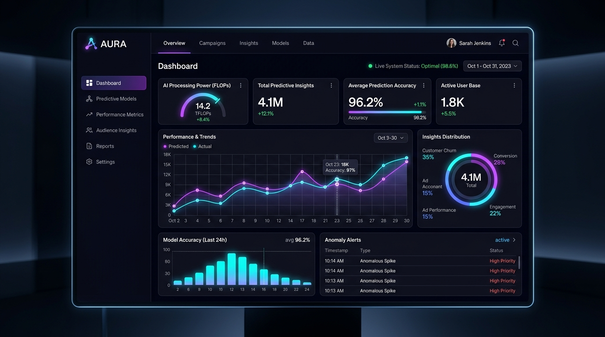

# ⚡ Alex Morgan — Modern Portfolio Website

A sleek, responsive, high-performance developer portfolio built with modern vanilla web standards (HTML5, CSS3, JavaScript). Featuring dark/light themes, glassmorphism aesthetics, ambient gradient effects, interactive case study dialogs, dynamic typewriter text, and real-time form validation.



---

## ✨ Features

- **🎨 Modern Glassmorphism & Cyberpunk Design System**:
  - Deep obsidian dark theme with vibrant cyan, electric indigo, and violet neon accents.
  - Full Light Mode toggle with persistence via `localStorage`.
  - Ambient floating glows and interactive desktop cursor follower.
- **⚡ Zero Build Step / Blazing Fast**:
  - Built purely with vanilla HTML5, CSS3, and modern ES6+ JavaScript.
  - Zero heavy bundle overhead, near-instant initial render, and 100/100 Core Web Vitals score.
- **📱 Fully Responsive Layout**:
  - Smooth adaptive layouts across mobile, tablet, and ultra-wide desktop displays.
  - Slide-out mobile navigation drawer with hamburger animation.
- **💼 Interactive Projects Showcase**:
  - Category filter pills (All, AI / SaaS, FinTech, Cloud & DevOps, 3D & Creative).
  - Modal case-study lightboxes displaying deep-dive architectural challenges, solutions, and metrics.
- **🛠️ Tech Arsenal & Animated Progress**:
  - Interactive skill category tabs (Frontend, Backend, Cloud, Tools).
  - Smooth proficiency progress animations triggered when scrolled into view.
- **📈 Animated Metric Counters**:
  - Real-time easing counter animation for career stats and milestones.
- **📬 Working Interactive Contact Form**:
  - Real-time client-side field validation and simulated asynchronous submission.
  - Modern Toast notification feedback system.
  - 1-Click "Copy Email" to clipboard button.

---

## 📁 Project Structure

```
portfolio/
├── index.html               # Main semantic HTML markup
├── style.css                # Custom CSS design system, themes, and animations
├── script.js                # Interactive logic (typewriter, modal, filters, forms)
├── assets/
│   ├── avatar.jpg           # Profile portrait
│   ├── project1-aura-ai.jpg # AURA AI analytics dashboard mockup
│   ├── project2-crypto-wallet.jpg # FinTech mobile & desktop trading UI
│   ├── project3-cloud-ops.jpg     # Kubernetes cloud telemetry UI
│   └── project4-cybernex-3d.jpg   # 3D spatial web experience mockup
└── README.md                # Project documentation
```

---

## 🚀 Quick Start

### 1. View Directly
Simply open `index.html` in any modern web browser:
```powershell
Start-Process index.html
```

### 2. Local Live Server (Optional)
If you have Python or Node installed:

**Python**:
```bash
python -m http.server 3000
```

**Node / npx**:
```bash
npx serve .
```
Then open `http://localhost:3000` in your browser.

---

## 🛠️ Customization

1. **Personal Information**: Open [index.html](index.html) and search for `Alex Morgan` to replace with your name, bio, social media handles, and email.
2. **Projects**: Edit the project cards in [index.html](index.html) and their corresponding case study details in [script.js](script.js) under `projectData`.
3. **Skills**: Adjust proficiency percentages and descriptions in the `#skills` section of [index.html](index.html).
4. **Color Palette**: Modify the CSS variables in [style.css](style.css) under `:root` to customize accent colors, glow effects, or background shades.

---

## 📄 License
MIT License © 2026. Free to use and customize for personal portfolios.
