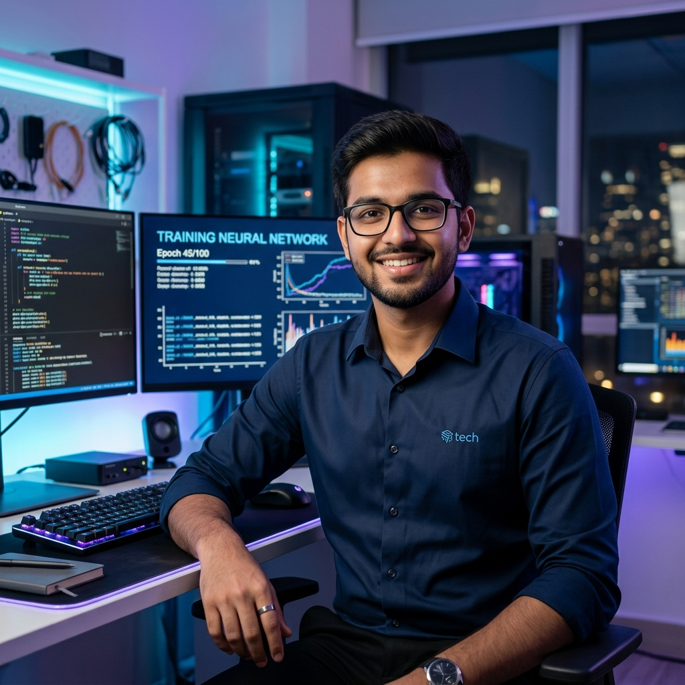

# 🧠 Sahil Singh — B.Tech Artificial Intelligence & Machine Learning Portfolio

A high-performance, futuristic portfolio website for **Sahil Singh**, an undergraduate engineering student in **Artificial Intelligence & Machine Learning (B.Tech AIML)**. Built with modern web standards (HTML5, CSS3, vanilla ES6+ JavaScript), featuring real-time neural inference simulation, interactive synapse network visualizers, case study architecture dialogs, dark/light themes, and an ATS-formatted CV modal.



---

## ✨ Highlights & Features

- **🧠 Deep Learning & AIML Specialization**:
  - Showcases real-world projects in Computer Vision, Vision Transformers (ViT), Grad-CAM, LLM/RAG Multi-Agent architectures, and Reinforcement Learning in CARLA.
- **⚡ Interactive Live AI Playground**:
  - **Neural Sentiment & Intent Classifier**: Real-time simulated inference with subword token stream, latency telemetry, and softmax probability distributions.
  - **Synapse Network Visualizer**: Interactive HTML5 canvas showing signal propagation through multi-layer perceptron synapses with forward-pass activations.
- **💼 Selected AI Systems**:
  - **NeuroVision**: Thoracic Pathology AI with Grad-CAM heatmaps (98.4% ROC-AUC).
  - **NexusRAG**: Autonomous Multi-Agent Knowledge Retrieval Engine (Llama-3-8B + ChromaDB).
  - **DeepDrive-RL**: Sensor Fusion Autonomous Driving Policy in CARLA (99.2% collision-free).
  - **CropPulse**: Hyperspectral Drone Crop Pathology AI (National Hackathon Top 5).
  - **AlphaForecaster**: Temporal Fusion Transformer Order Book ML.
  - **SynthVoice**: Multilingual Speech Recognition & Neural Synthesis.
- **🎓 Formal Education & Hackathons**:
  - B.Tech in Artificial Intelligence & Machine Learning (CGPA: 8.92 / 10.0).
  - Smart India Hackathon (SIH) National Finalist.
  - 1st Place Winner at National Collegiate AI Conclave.
  - Certifications: DeepLearning.AI Specialization (Andrew Ng), AWS Certified Machine Learning, Hugging Face Transformers.
- **📄 Interactive ATS Resume / CV Modal**:
  - Embedded clean resume with 1-click **Print / Save PDF** support.
- **📬 Working Interactive Contact Form**:
  - Real-time client-side validation, direct contact information, and 1-click email copy.

---

## 📁 Project Structure

```
potfolio/
├── index.html               # Main semantic HTML5 markup
├── style.css                # Futuristic design system, cyber-neural theme, responsive rules
├── script.js                # AI playground simulation, synapse canvas, case study modals
├── assets/
│   ├── sahil_portrait.jpg   # Profile portrait of Sahil Singh
│   ├── project1-neurovision.jpg # NeuroVision medical diagnostic AI UI
│   ├── project2-nexusrag.jpg    # NexusRAG multi-agent LLM engine
│   ├── project3-deepdrive.jpg   # DeepDrive-RL CARLA simulation
│   └── project4-croppulse.jpg   # CropPulse drone agriculture AI
└── README.md                # Project documentation
```

---

## 🚀 Quick Start

### 1. View Locally
Simply open `index.html` in your web browser:
```powershell
Start-Process index.html
```

### 2. Local Live Server
Run the included PowerShell static server:
```powershell
powershell -ExecutionPolicy Bypass -File serve.ps1
```
Or with Python:
```bash
python -m http.server 8080
```
Then visit `http://localhost:8080`.

---

## 📄 License
MIT License © 2026 Sahil Singh.
